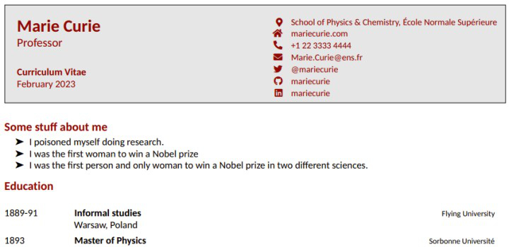

# [atet](https://github.com/atet) / [**_vitae_**](https://github.com/atet/vitae/blob/main/README.md#atet--vitae)

[](#nolink)

# Introduction to R Package `vitae`

**Estimated time to completion: 15 minutes**

This introduction covers what is absolutely necessary to get you up and running to make resumes & CVs ([curriculum vitae](https://www.merriam-webster.com/dictionary/curriculum%20vitae)) through coding in R.

**_What is a CV?_** Unlike a resume, a CV details **everything** from your career; so unless someone asks specifically for this, you're better off with a more concise resume.

--------------------------------------------------------------------------------------------------

## Table of Contents

### Introduction

* [0. Requirements](#0-requirements)
* [1. Installation](#1-installation)
* [2. Examples](#2-examples)
* [3. Next Steps](#3-next-steps)

### Supplemental

* [Other Resources](#other-resources)
* [Troubleshooting](#troubleshooting)
* [Acknowledgments](#acknowledgments)

--------------------------------------------------------------------------------------------------

## 0. Requirements

* This tutorial was developed on Microsoft Windows 10; the programs here are available for MacOS and Linux (such as Ubuntu Linux):
   1. R programming language
   2. RStudio IDE
* You must be connected to the internet for packages to automatically download dependencies and other critical files
* R `sessionInfo()`:

```r
> sessionInfo()
R version 4.2.2 (2022-10-31 ucrt)
Platform: x86_64-w64-mingw32/x64 (64-bit)
Running under: Windows 10 x64 (build 19045)
.
.
.
other attached packages:
[1] tinytex_0.44 vitae_0.5.2

loaded via a namespace (and not attached):
 [1] fansi_1.0.3      digest_0.6.30    utf8_1.2.2       dplyr_1.1.0     
 [5] R6_2.5.1         lifecycle_1.0.3  magrittr_2.0.3   evaluate_0.20   
 [9] pillar_1.8.1     rlang_1.0.6      cli_3.4.1        vctrs_0.5.2     
[13] generics_0.1.3   rmarkdown_2.20   tools_4.2.2      glue_1.6.2      
[17] yaml_2.3.7       fastmap_1.1.0    xfun_0.37        compiler_4.2.2  
[21] pkgconfig_2.0.3  htmltools_0.5.4  knitr_1.42       tidyselect_1.2.0
[25] tibble_3.1.8 
```

[Back to Top](#table-of-contents)

--------------------------------------------------------------------------------------------------

## 1. Installation

Open RStudio and install the following packages in this order (dependencies will automatically install)

### LaTeX via `tinytex` package

* To use the R `vitae` package, you must have LaTeX installed
* LaTeX is a high-quality font system used for technical & scientific documentation
* We will install the lightweight alternative to LaTeX through the `tinytex` package
* NOTE: You must be connected to the internet

```r
> install.packages("tinytex")
> tinytex::install_tinytex()
```

* Confirm that `tinytex` works by creating the file `test.tex` in the current working directory and converting it to the PDF file `test.pdf`:

```r
> writeLines(c(
    "\\documentclass{article}",
    "\\begin{document}", "Hello world!", "\\end{document}"
  ), "test.tex")
> tinytex::pdflatex("test.tex")
```

<a href=".pdf/test.pdf" download></a>

### `vitae` package

* Install the `vitae` package next
* NOTE: You must be connected to the internet

```r
> install.packages("vitae")
```

[Back to Top](#table-of-contents)

--------------------------------------------------------------------------------------------------

## 2. Examples

* We will start from any of the six premade template styles
* To load a template, go to `File` → `New File` → `R Mardown...` → `From Template` → `Curriculum Vitae (<STYLE> format)`

[](#nolink)

* In order to convert the RMarkdown template into PDF, you have to "`Knit`" it
* NOTE: The first time a template style is `Knit` to PDF, you must be connected to the internet to download additional files

[](#nolink)

### **The following six template styles are available by default:**

### 1. Curriculum Vitae (Awesome-CV format)

<a href=".pdf/template_Awesome-CV.pdf" download></a>

### 2. Curriculum Vitae (Hyndman format)

<a href=".pdf/template_Hyndman.pdf" download></a>

### 3. Curriculum Vitae (latexcv format)

<a href=".pdf/template_latexcv.pdf" download></a>

### 4. Curriculum Vitae (markdown-cv format)
* NOTE: "`markdown-cv format`" does not export a PDF

[](#nolink)

### 5. Curriculum Vitae (ModernCV format)

<a href=".pdf/template_ModernCV.pdf" download></a>

### 6. Curriculum Vitae (Twenty seconds format)

<a href=".pdf/template_Twenty seconds.pdf" download></a>

[Back to Top](#table-of-contents)

--------------------------------------------------------------------------------------------------

## 3. Next Steps

If you've wasted enough time on Microsoft Word messing with margins and spacing, you'll probably appreciate making your resume or CV through code.

Check out other tutorials that dive into customization like this one: https://www.anthonyschmidt.co/post/2022-04-21-make-an-easy-to-maintain-cv-or-resume-using-r

[Back to Top](#table-of-contents)

--------------------------------------------------------------------------------------------------

## Other Resources

Description | Link
--- | ---
Introduction to R programming | [https://github.com/atet/learn/tree/master/programming](https://github.com/atet/learn/blob/master/programming/README.md#atet--learn--programming)
Official `vitae` Github | [https://github.com/mitchelloharawild/vitae](https://github.com/mitchelloharawild/vitae/blob/master/README.md#vitae-)
Using `vitae` | https://www.anthonyschmidt.co/post/2022-04-21-make-an-easy-to-maintain-cv-or-resume-using-r

[Back to Top](#table-of-contents)

--------------------------------------------------------------------------------------------------

## Troubleshooting

Issue | Solution
--- | ---
Crashing when converting to PDF | Reinstall the `tinytex` package and restart your computer
Hanging when converting to PDF | You must be connected to the internet for `vitae` to automatically download necessary files the first time a template is converted to PDF

[Back to Top](#table-of-contents)

--------------------------------------------------------------------------------------------------

## Acknowledgments

1. Page header logo is adapted from images: [https://github.com/mitchelloharawild/vitae](https://github.com/mitchelloharawild/vitae/blob/master/man/figures/logo.png)

[Back to Top](#table-of-contents)

--------------------------------------------------------------------------------------------------

<p align="center">Copyright © 2023-∞ Athit Kao, <a href="http://www.athitkao.com/tos.html" target="_blank">Terms and Conditions</a></p>